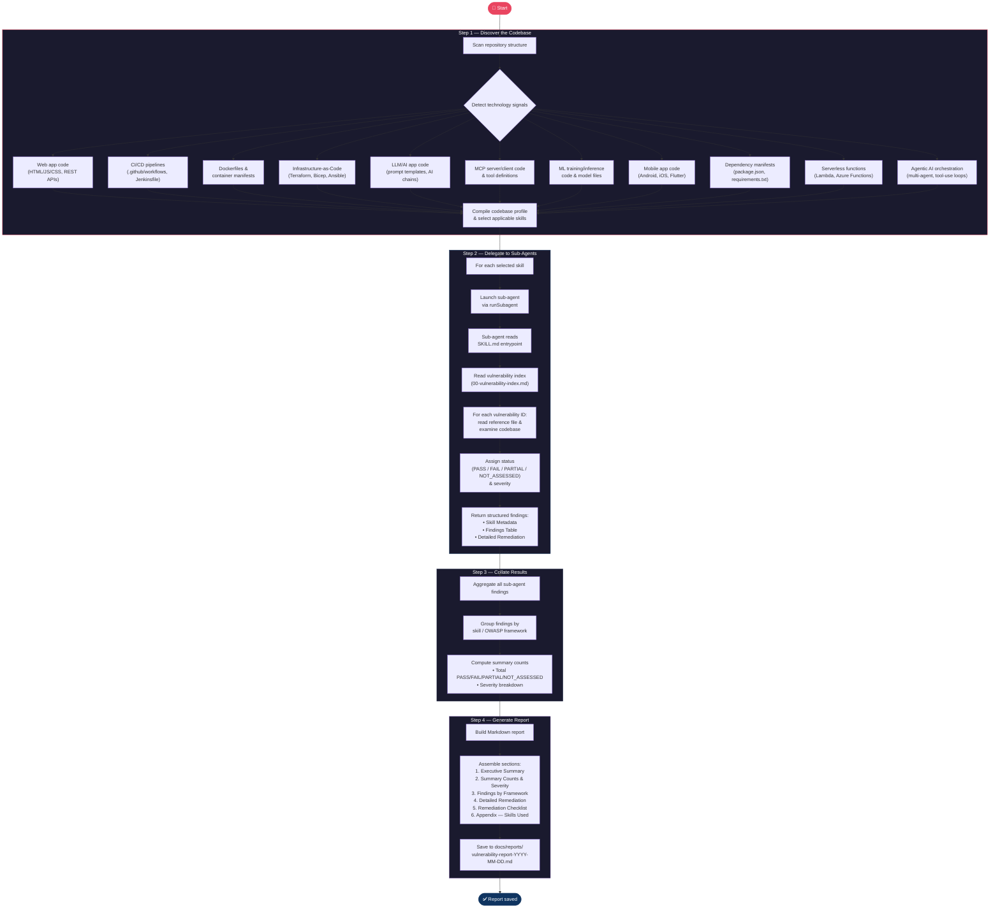

# OWASP Agent Skills

This repository contains a series of skills covering a range of OWASP related top 10 vulnerabilities.

These vulnerabilities are:

- [OWASP Top 10 for Agentic Applications for 2026](https://genai.owasp.org/resource/owasp-top-10-for-agentic-applications-for-2026/)
- [OWASP Top 10 CI/CD Securtiy Risks](https://owasp.org/www-project-top-10-ci-cd-security-risks/)
- [OWASP Docker Top 10](https://owasp.org/www-project-docker-top-10/)
- [OWASP Top 10 Infrastructure Security Risks](https://owasp.org/www-project-top-10-infrastructure-security-risks/)
- [OWASP Top 10 for LLM Applications 2025](https://genai.owasp.org/resource/owasp-top-10-for-llm-applications-2025/)
- [OWASP MCP Top 10](https://owasp.org/www-project-mcp-top-10/)
- [OWASP Machine Learning Security Top Ten](https://owasp.org/www-project-machine-learning-security-top-10/)
- [OWASP Mobile Top 10](https://owasp.org/www-project-mobile-top-10/)
- [OWASP Top 10 Risks for Open Source Software](https://owasp.org/www-project-open-source-software-top-10/)
- [OWASP Serverless Top 10](https://owasp.org/www-project-serverless-top-10/)
- [OWASP Top 10 2025](https://owasp.org/Top10/2025/)

Skills are based off [Agnostic Prompt Standard (APS)](https://github.com/chris-buckley/agnostic-prompt-standard)

To use skills in Visual Studio Code be sure to enable `chat.useAgentSkills`

## Vulnerability Scanner Agent Flow

## Legal

This project is licensed under the [MIT License](./LICENSE).

### Licensing

Most content in this repository is covered by the MIT License. Certain skill content
derived from OWASP Foundation publications is licensed under either
[CC BY-SA 4.0](https://creativecommons.org/licenses/by-sa/4.0/) or
[CC BY-NC-SA 4.0](https://creativecommons.org/licenses/by-nc-sa/4.0/). Each affected
skill identifies its license in frontmatter and includes a Third-Party Attribution
section. See [THIRD-PARTY-NOTICES](./THIRD-PARTY-NOTICES) for full details.
